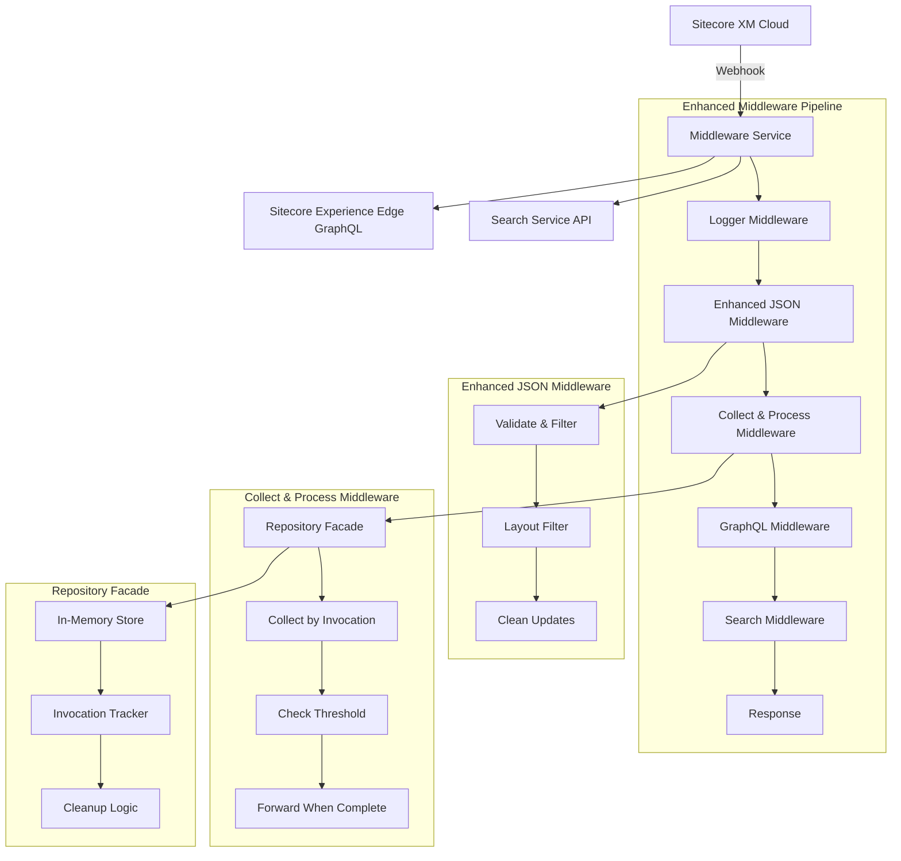

# Refactoring Plan for Search IU POC

## Current System Understanding

The system is a middleware service that processes updates from Sitecore XM Cloud (XMC) and forwards them to a search service. It handles incremental updates for content changes and manages the flow between content management and search indexing.

## Issues Identified from THEORY.md

1. **jsonOnlyMiddleware inefficiency**: Currently checks type of every update item but should filter out non-conforming updates and those without "-layout" in identifier
2. **Missing CollectAndProcessMiddleware**: Need to collect updates for an invocation until "continues" is false
3. **No lightweight repository**: Need in-memory facade to collect invocations and their items

## Proposed Refactoring Plan

### Phase 1: Improve jsonOnlyMiddleware
- [ ] Separate validation logic from filtering logic
- [ ] Filter out updates that don't conform to `isUpdate`
- [ ] Filter out updates that don't have "-layout" in their identifier
- [ ] Improve error handling and logging

### Phase 2: Create CollectAndProcessMiddleware
- [ ] Design middleware to collect updates by invocation_id
- [ ] Add logic to forward collected updates when continues=false
- [ ] when false and data should be processed: implement threshold checking mechanism

### Phase 3: Implement Lightweight Repository Facade
- [ ] Create in-memory repository for invocations
- [ ] Design data structures for efficient collection and retrieval
- [ ] Implement cleanup mechanisms for completed invocations
- [ ] Add monitoring and debugging capabilities

## Target Architecture

## Implementation Strategy

1. **Single Responsibility**: Each middleware will have one clear purpose
2. **Open/Closed**: Design for extension without modification
3. **Interface Segregation**: Clean interfaces between components
4. **Dependency Inversion**: Depend on abstractions, not concrete implementations

## Success Criteria

- [ ] Improved performance through better filtering
- [ ] Proper batching and collection of updates
- [ ] Clean separation of concerns
- [ ] Maintainable and testable code
- [ ] Comprehensive error handling
- [ ] Proper resource cleanup

Would you like me to proceed with implementing these changes according to this plan?
