# Refactoring ideas - IMPLEMENTED ✅

## Completed Improvements

### ✅ Enhanced jsonOnlyMiddleware (loggerMiddleware.ts)
- **DONE**: Separated validation logic from filtering logic
- **DONE**: Filters out updates that don't conform to `isUpdate` 
- **DONE**: Filters out updates that don't have "-layout" in their "identifier" property
- **DONE**: Improved error handling and logging using pure functions

### ✅ CollectAndProcessMiddleware (collectAndProcessMiddleware.ts)
- **DONE**: Collects updates for an invocation id until "continues" is false
- **DONE**: When "continues" is false, it forwards the collected updates
- **DONE**: Implements threshold checking - if count is above threshold, processing is skipped
- **DONE**: Provides clear feedback about batching status

### ✅ Lightweight Repository Facade (invocationRepository.ts)
- **DONE**: Created in-memory repository to collect invocations and their items
- **DONE**: Efficient data structures for collection and retrieval
- **DONE**: Cleanup mechanisms for completed invocations
- **DONE**: Monitoring and debugging capabilities with statistics
- **DONE**: ✨ **CLEAN ARCHITECTURE**: Repository has no knowledge of webhook-specific concepts like "continues"
- **DONE**: ✨ **PURE DOMAIN MODEL**: Only handles invocations and updates, not protocol details

## Enhanced Pipeline Flow

```mermaid
graph TB
    XMC[Sitecore XM Cloud] -->|Webhook POST /published| MW[Middleware Service]
    
    subgraph "Enhanced Middleware Pipeline ✅"
        MW --> LM[Logger Middleware]
        LM --> JM[Enhanced JSON Middleware ✅]
        JM --> CM[Collect & Process Middleware ✅]
        CM --> GM[GraphQL Middleware]
        GM --> SM[Search Middleware]
        SM --> RESP[Response]
    end
    
    subgraph "Enhanced JSON Middleware ✅"
        JM --> VF[Validate Updates Array]
        VF --> LF[Filter Layout Updates Only]
        LF --> PASS[Pass Filtered Updates]
    end
    
    subgraph "Collect & Process Middleware ✅"
        CM --> REPO[Repository Facade ✅]
        REPO --> COL[Collect by Invocation ID]
        COL --> CHK{continues = false?}
        CHK -->|Yes| THR[Check Threshold]
        CHK -->|No| BATCH[Acknowledge Batch]
        THR -->|Under Threshold| FWD[Forward All Updates]
        THR -->|Over Threshold| SKIP[Skip Processing]
        BATCH --> ACK[Return 200 + Stats]
    end
    
    subgraph "Repository Facade ✅"
        REPO --> MEM[In-Memory Map]
        MEM --> INV[Invocation Tracking]
        INV --> AUTO[Auto Cleanup]
        AUTO --> STATS[Statistics Monitoring]
    end
    
    MW --> SEARCH[Search Service API]
    MW --> EE[Sitecore Experience Edge GraphQL]
```

## 🆕 Additional Refactoring Ideas for Future Iterations

- All validation should be in a ValidationMiddleware
- All filtering should be in a FilteringMiddleware  
- types.ts isUpdate should be isItem
- types.ts validateUpdatesArray should only check if it's an array, not if it's isItem/isUpdate